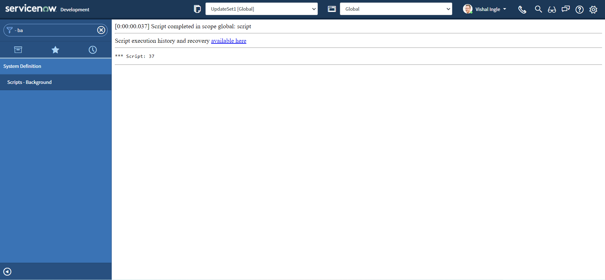

# GlideAggregate

&nbsp;&nbsp;&nbsp;&nbsp;Recently, I gave an interview, where I was asked to write a script in scripts - background to print priority-wise count of all incident records. And I could not do it. Primarily because I did never use this API for anything else but getting the COUNT. So this is the time for doing what I don't not do and probably you do not as well. So let us dig what this API is.

&nbsp;&nbsp;&nbsp;&nbsp;If you did not get what exactly I was asked to do, follow this steps:

- Navigate to **Incident > All**


- Right-click the column **Priority** and select **Group By Priority**.


- Your window will display something like this:


&nbsp;&nbsp;&nbsp;&nbsp;Here, You will notice:

- Groups are named for the values of the field selected for grouping. For example, in our case, since we grouped by Priority, each group is a Priority's display name.
- The record count for each group appears next to the group name/Priority.
- The total number of items in the list (all groups/Priorities combined) appears near the paging controls in the list.

&nbsp;&nbsp;&nbsp;&nbsp;I had to write a script to print the output as shown in the last screenshot above. If you want to read more about "Grouped lists" you can find it [here](https://docs.servicenow.com/bundle/sandiego-platform-user-interface/page/use/using-lists/concept/c_GroupedLists.html).

## What is GlideAggregate

&nbsp;&nbsp;&nbsp;&nbsp;GlideAggregate is an extension of GlideRecord. It provides the capability to do aggregation (COUNT, SUM, MIN, MAX, AVG). These operations can be done with regular GlideRecord use, but with GlideAggregate, they are optimized around these use cases and offer significant efficiencies.

### Getting the number of records for GlideRecord query

&nbsp;&nbsp;&nbsp;&nbsp;One of the frequently used use case is finding number of records for a a GlideRecord query. This can be achieved using getRowCount for a GlideRecord query, which is not a efficient solution if no operation is performed with the returned records. Alternatively, use of GlideAggreggate can improve the performance significantly. Let us see how to script both the ways:

#### getRowCount

- Copy the below script to scripts - background, and click **Run script** button:

```js
var grInc = new GlideRecord("incident")
grInc.query()
gs.info(grInc.getRowCount())
```


- You should see the output similar to the following:


- Now, Navigate to **Incident > All**


- Right-click the value **New** for column **State** and select **Show Matching**.


- Your window will display something like below, Observe that the condition State = New has been added to the filter and the total number of records with this filter:


- Right-click the end of the filter breadcrumb and select **Copy query** from the context menu:


- Now, let us modify the script as below to use encoded query copied above to filter the records:

```js
var grInc = new GlideRecord("incident")
grInc.addEncodedQuery("state=1")
grInc.query()
gs.info(grInc.getRowCount())
```

- Copy the above script to scripts - background, and click **Run script** button:


- You should see the output similar to the following:



&nbsp;&nbsp;&nbsp;&nbsp;This is the traditional way of getting number of records for a specific filter. You can dig documentation to know more about [Copy query](https://docs.servicenow.com/bundle/rome-platform-user-interface/page/use/using-lists/task/t_GenEncodQueryStringFilter.html) & [Quick filters](https://docs.servicenow.com/bundle/sandiego-platform-user-interface/page/use/using-lists/concept/c_QuickFilters.html).

#### GlideAggregate

&nbsp;&nbsp;&nbsp;&nbsp;There is alternate way of scripting the same using GlideAggregate that can improve the performance significantly and is more efficient:

- Copy the below script to scripts - background, and click **Run script** button:

```js
var grInc = new GlideAggregate("incident")
grInc.addEncodedQuery("state=1")
grInc.addAggregate("COUNT")
grInc.query()
if (grInc.next()) {
  gs.info(grInc.getAggregate("COUNT"))
}
```


- You should see the output similar to the following:


&nbsp;&nbsp;&nbsp;&nbsp;In the above script,

- addAggregate() method is used to ask needed information.
- getAggregate() method gets the value of an aggregate from the current record.

### Group records

&nbsp;&nbsp;&nbsp;&nbsp;Now, we can get back to our initial requirement:

- Navigate to **Incident > All**
  
- Right-click the column **Priority** and select **Group By Priority**.
  
- Your window will display something like this:
  

- Copy the below script to scripts - background, and click **Run script** button:

```js
var grInc = new GlideAggregate("incident")
grInc.groupBy("priority")
grInc.addAggregate("COUNT")
grInc.query()
while (grInc.next()) {
  gs.info("Priority: {0} ({1})", [
    grInc.getDisplayValue("priority"),
    grInc.getAggregate("COUNT"),
  ])
}
```


- You should see the output similar to the following:


&nbsp;&nbsp;&nbsp;&nbsp;In the above script, groupBy() provides the name of a field to use in grouping the aggregates. Alternatively, we can use the second parameter of addAggregate() method to achieve the same result:

- Copy the below script to scripts - background, and click **Run script** button:

```js
var grInc = new GlideAggregate("incident")
grInc.addAggregate("COUNT", "priority")
grInc.query()
while (grInc.next()) {
  gs.info("Priority: {0} ({1})", [
    grInc.getDisplayValue("priority"),
    grInc.getAggregate("COUNT", "priority"),
  ])
}
```


- You should see the output similar to the following:


### getTotal()

&nbsp;&nbsp;&nbsp;&nbsp;Let us modify our script to introduce another method, getTotal(), which returns the number of records by summing an aggregate:

- Copy the below script to scripts - background, and click **Run script** button:

```js
var grInc = new GlideAggregate("incident")
grInc.addAggregate("COUNT", "priority")
grInc.query()
while (grInc.next()) {
  gs.info("Priority: {0} ({1})", [
    grInc.getDisplayValue("priority"),
    grInc.getAggregate("COUNT", "priority"),
  ])
}
gs.info(grInc.getTotal("COUNT"))
```


- You should see the output similar to the following:


### groupBy() and COUNT

&nbsp;&nbsp;&nbsp;&nbsp;At this point you should ask if there are two ways to group, what is the difference between them? Let us modify the script a bit to use both groupBy() and COUNT together:

- Copy the below script to scripts - background, and click **Run script** button:

```js
var grInc = new GlideAggregate("incident")
grInc.groupBy("priority")
grInc.groupBy("state")
grInc.addAggregate("COUNT", "priority")
grInc.query()
while (grInc.next()) {
  gs.info("Priority: {0} & State: {1} ({2})", [
    grInc.getDisplayValue("priority"),
    grInc.getDisplayValue("state"),
    grInc.getAggregate("COUNT", "priority"),
  ])
}
gs.info(grInc.getTotal("COUNT"))
```


- You should see the output similar to the following:


&nbsp;&nbsp;&nbsp;&nbsp;Here We did print number of records for each priority grouped by state. Let us verify the results:

- Navigate to **Incident > All**


- Right-click the column **Priority** and select **Group By Priority**.


- Your window will display something like this:


- Now, click the **arrow icon** next to the Priority 'Critical' to expand the group


- Right-click the value **In Progress** for column **State** and select **Show Matching**.


- You should see the output similar to the following:


### Sorting the result

#### orderBy()

&nbsp;&nbsp;&nbsp;&nbsp; Let us introduce another method called orderBy(), which provides the name of a field that should be used to order the aggregates.:

- Copy the below script to scripts - background, and click **Run script** button:

```js
var grInc = new GlideAggregate("incident")
grInc.groupBy("priority")
grInc.groupBy("state")
grInc.addAggregate("COUNT", "priority")
grInc.orderBy("priority")
grInc.orderBy("state")
grInc.query()
while (grInc.next()) {
  gs.info("Priority: {0} & State: {1} ({2})", [
    grInc.getDisplayValue("priority"),
    grInc.getDisplayValue("state"),
    grInc.getAggregate("COUNT", "priority"),
  ])
}
gs.info(grInc.getTotal("COUNT"))
```


- You should see the output similar to the following:


&nbsp;&nbsp;&nbsp;&nbsp; In the above example, we did sort the list by Priority and state.

#### orderByAggregate()

&nbsp;&nbsp;&nbsp;&nbsp; Another variation of orderBy() is orderByAggregate(), which orders the aggregates based on the specified aggregate and field. Let us slightly modify our script:

- Copy the below script to scripts - background, and click **Run script** button:

```js
var grInc = new GlideAggregate("incident")
grInc.groupBy("priority")
grInc.groupBy("state")
grInc.addAggregate("COUNT", "priority")
grInc.orderByAggregate("count", "priority")
grInc.query()
while (grInc.next()) {
  gs.info("Priority: {0} & State: {1} ({2})", [
    grInc.getDisplayValue("priority"),
    grInc.getDisplayValue("state"),
    grInc.getAggregate("COUNT", "priority"),
  ])
}
gs.info(grInc.getTotal("COUNT"))
```


- You should see the output similar to the following:


&nbsp;&nbsp;&nbsp;&nbsp; You might have already noticed that the result is now sorted by the number of records.

#### orderByAggregate()

&nbsp;&nbsp;&nbsp;&nbsp; Another variation of orderBy() is orderByAggregate(), which orders the aggregates based on the specified aggregate and field. Let us slightly modify our script:

- Copy the below script to scripts - background, and click **Run script** button:

```js
var grInc = new GlideAggregate("incident")
grInc.groupBy("priority")
grInc.groupBy("state")
grInc.addAggregate("COUNT", "priority")
grInc.orderByAggregate("count", "priority")
grInc.query()
while (grInc.next()) {
  gs.info("Priority: {0} & State: {1} ({2})", [
    grInc.getDisplayValue("priority"),
    grInc.getDisplayValue("state"),
    grInc.getAggregate("COUNT", "priority"),
  ])
}
gs.info(grInc.getTotal("COUNT"))
```


- You should see the output similar to the following:


&nbsp;&nbsp;&nbsp;&nbsp; This method is extermely useful when you want to trigger something if record count crosses the defined threshold or to find duplicate records. You can find the awesome post on snprotips blog by Tim Woodruff [here](https://snprotips.com/blog/rvicenowprotips.com/2015/12/detecting-duplicate-records-with.html) regarding same.

---

### Where can you learn more?

&nbsp;&nbsp;&nbsp;&nbsp;Here is some of the resources which will help provide examples and use cases to furthur enhance your understanding:

- [ServiceNow API documentation](https://developer.servicenow.com/dev.do#!/reference/api/sandiego/server_legacy/c_GlideAggregateAPI)
- [Understanding GlideAggregate by Andrew Barnes](https://developer.servicenow.com/blog.do?p=/post/glideaggregate/)
- [ServiceNow product documentation](https://docs.servicenow.com/bundle/sandiego-application-development/page/app-store/dev_portal/API_reference/GlideAggregate/concept/c_GlideAggregateAPI.html)
- [Observations When Using GlideAggregate with Steven Bell](https://www.youtube.com/watch?v=KmxsVbnAHxk)
- [GlideAggregate Examples by GarrettNow](https://garrettnow.com/2014/02/28/glideaggregate-examples/) -[COUNTING WITH GLIDEAGGREGATE by BEN SWEETSER](https://developer.servicenow.com/blog.do?p=/post/training-glideagg/)

//Draft

https://www.thiscodeworks.com/tag/servicenow

/_
Client callable script include used for filtering sys_user lists
to identify duplication email users
name: duplicateEmail
active: true
client callabe: true
_/
function duplicateEmail() {
var xx = new GlideAggregate('sys_user');
xx.addAggregate('COUNT', 'email');
xx.addHaving('COUNT', 'email', '>', '1');
xx.query();
var answer = new Array();
while (xx.next()) {
answer.push(xx.getValue('email'));
}
return answer;
}

http://snowscrip.blogspot.com/2019/03/background-scripts.html

https://codecreative.io/blog/3-strategies-to-fix-nested-gliderecords/

https://www.learnnowlab.com/advance-glide-script/

- [How to get the Top 10 values from a table using the GlideAggregate function](https://support.servicenow.com/kb?id=kb_article_view&sysparm_article=KB0745198)

https://learning.oreilly.com/library/view/mastering-servicenow-scripting/9781788627092/1123612d-e720-4b69-8805-8976af94a59c.xhtml

https://snowunderground.com/blog/tag/glideaggregate

https://pathwayscg.com/easily-identifying-duplicate-records-in-servicenow/

https://finite-partners.com/byte-2-glideaggregate-examples/

https://community.servicenow.com/community?id=community_article&sys_id=4184de51db982348a39a0b55ca961960

https://books.google.co.in/books?id=TJjcDgAAQBAJ&pg=PA99&lpg=PA99&dq=GlideAggregate&source=bl&ots=oFFCZghU6j&sig=ACfU3U0u-D0AjDAf6bmZpXa9udzMXf7_TQ&hl=en&sa=X&ved=2ahUKEwjgyYCVwMX2AhUZrVYBHYrPDXw4MhDoAXoECBEQAw#v=onepage&q=GlideAggregate&f=false

https://sn.jace.pro/getting-started/GlideAggregate/

https://www.acorio.com/servicenow-hacks-to-try-home/

https://shalamaster.com/GLIDEAGGREGATE.html
