# GlideExcelParser

&nbsp;&nbsp;&nbsp;&nbsp;Recently, we did recieve a requirement to build a catalog item for Asset managers, to auto-import asset information in the platform based on attached excel sheet. Additionally, we had to reject the request if the data is missing or does not have referenced records available yet in the system.
&nbsp;&nbsp;&nbsp;&nbsp;While exploring a bit, I found this amazing API called **GlideExcelParser** documented [here](https://developer.servicenow.com/dev.do#!/reference/api/quebec/server/GEPS-setNullToEmpty_B). If you haven't used it yet like me, Let's learn together.

## What is GlideExcelParser

&nbsp;&nbsp;&nbsp;&nbsp;`GlideExcelParser` parses `.xlsx` formatted Excel files and access file data in a script.
Although, GlideExcelParser methods can be used in both global and scoped scripts, you need to use the `sn_impex` namespace identifier to create a GlideExcelParser object.

&nbsp;&nbsp;&nbsp;&nbsp;What it means is, to creates an instance of GlideExcelParser, we need to use the following syntax:
```javascript
var parser = new sn_impex.GlideExcelParser();
```

### Creating a demo data sheet

&nbsp;&nbsp;&nbsp;&nbsp;Though, ServiceNow documentation is very clear and pretty self-explanatory (along with the awesome, easy to understand examples), what lacks for this API documentation is a demo data sheet to visualize it better. So before proceeding furthur, Let's create a demo data sheet for ourselves:


### Creating a fix script

&nbsp;&nbsp;&nbsp;&nbsp;It is not necessary to create a fix script for our use case. But, it is always a good idea to test if our code is working as expected. And Fix script always seems to be a better choice than Background script. Also, In order to test our APIs with the demo sheet that we did create, It needs to be in the platform as an attachment. Fix script can also solve that purpose in this case. So let's go ahead and create a fix script and attach our demo sheet to it:

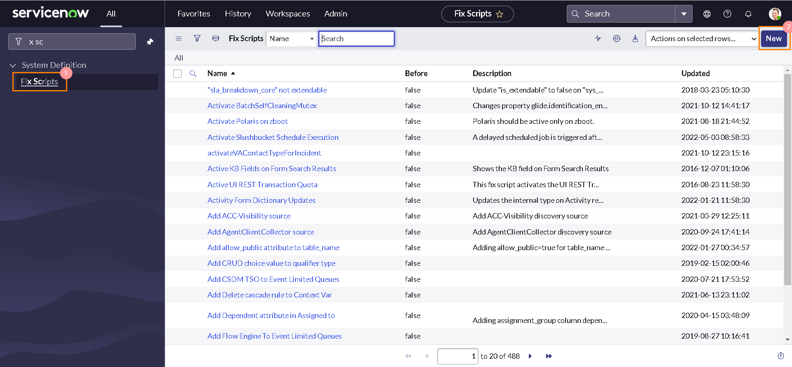
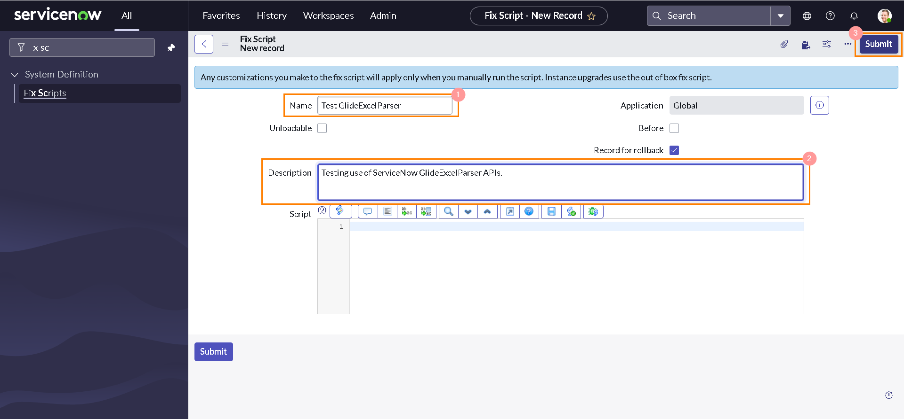
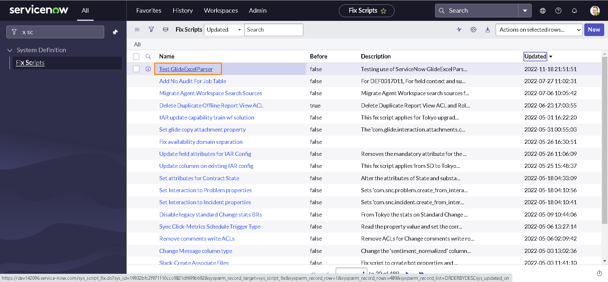
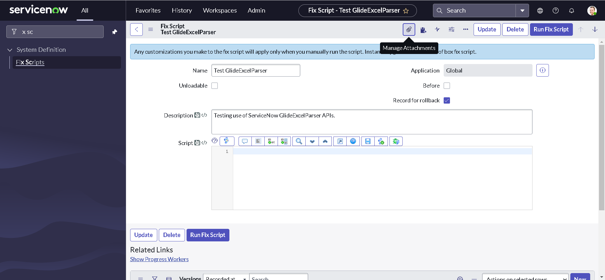
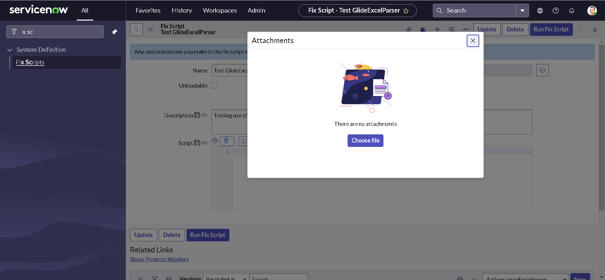
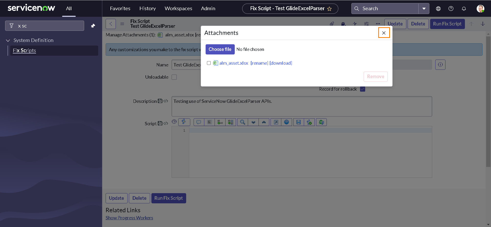
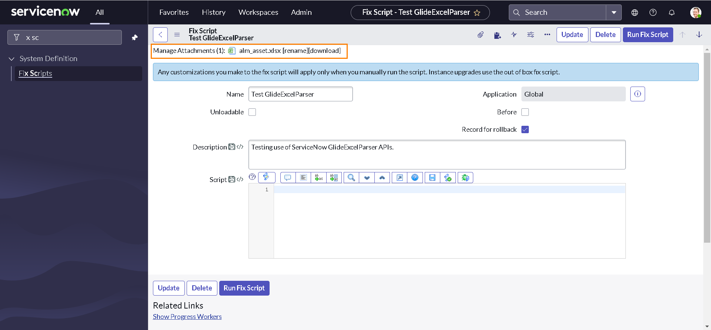

### Testing GlideExcelParser APIs

&nbsp;&nbsp;&nbsp;&nbsp;Now that we have our Fix script and demo data sheet attached to it, we are good to explore GlideExcelParser APIs. But, the very first thing that we need to test our APIs is the SysID of our demo data sheet attachment. Let's write the below code to our fix script to fetch the attachment SysID:

```javascript
//Get attachment SysID

var attachmentSysID = "";

var tableName = "sys_script_fix";
var tableSysID = "19932bfc2f971110ccc9821df699b692";

var grAttachment = new GlideRecord("sys_attachment");
grAttachment.addEncodedQuery("table_name=" + tableName + "^table_sys_id=" + tableSysID);
grAttachment.query();
if (grAttachment.next()) {
    attachmentSysID = grAttachment.getUniqueValue();
}

gs.info("attachmentSysID: " + attachmentSysID);
```

&nbsp;&nbsp;&nbsp;&nbsp;You should replace the value of `tableSysID` by SysID of your fix script. Right click on the form header and click `Save` to save your code.

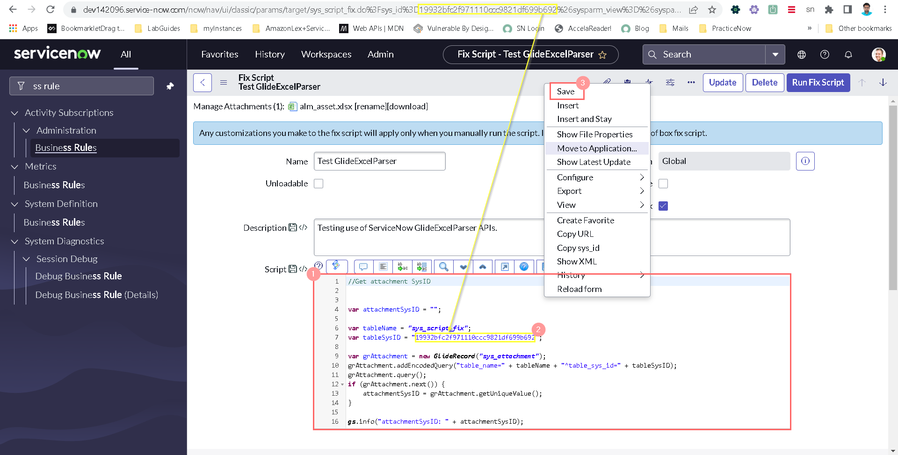

&nbsp;&nbsp;&nbsp;&nbsp;To test if we are getting the SysID of our attachment, Click `Run Fix Script` button on the header and then select `Proceed`.

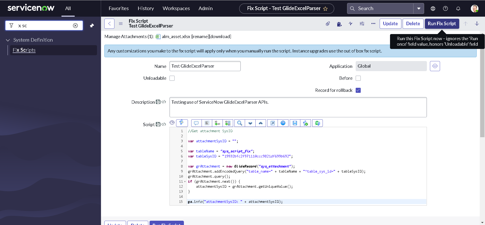
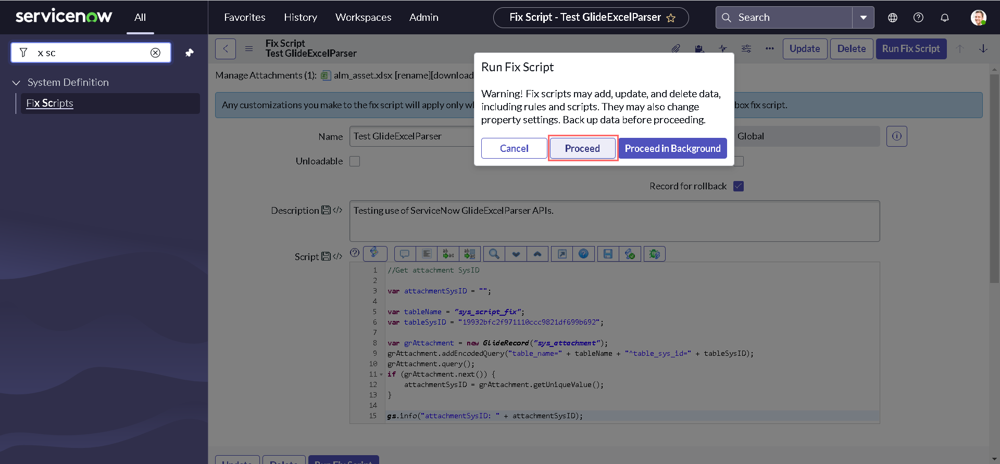

&nbsp;&nbsp;&nbsp;&nbsp;As soon as the code finishes execution, we can see the output with the SysID of our attachment returned. Click `Close` to close the dialog window.

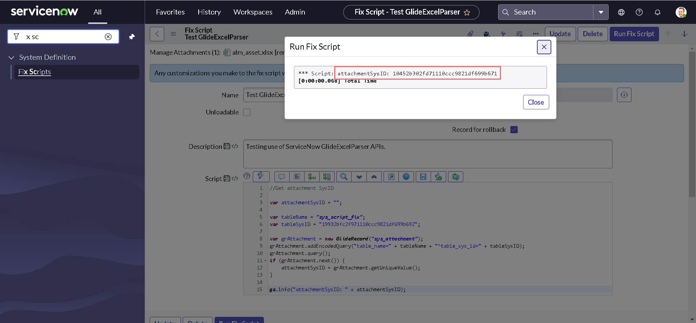

#### GlideSysAttachment getContentStream()

&nbsp;&nbsp;&nbsp;&nbsp;`getContentStream()` function of `GlideSysAttachment` accepts attachment `sys_id` as a parameter and returns a `GlideScriptableInputStream` object given the sys_id of an attachment that contains the content of an attachment. GlideSysAttachment APIs is a separate topic of discussion and we might talk about it in future articles, but for now, let us add following lines at the end of our script:

```javascript
var attachment = new GlideSysAttachment();
var attachmentStream = attachment.getContentStream(attachmentSysID);
gs.info('Attachment content stream: ' + attachmentStream);
```
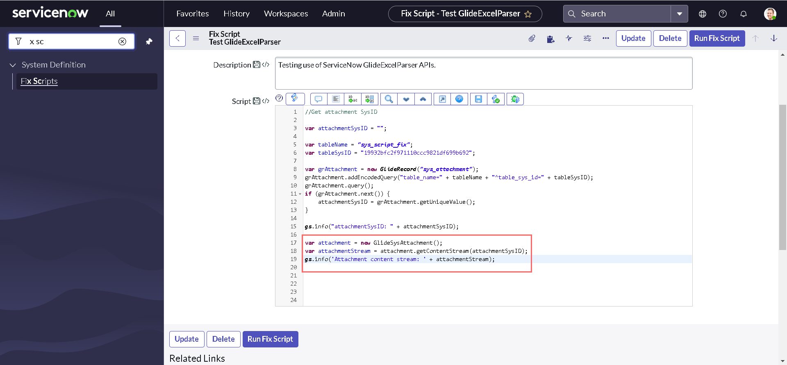

&nbsp;&nbsp;&nbsp;&nbsp;After executing the code again, you should get output similar to this:

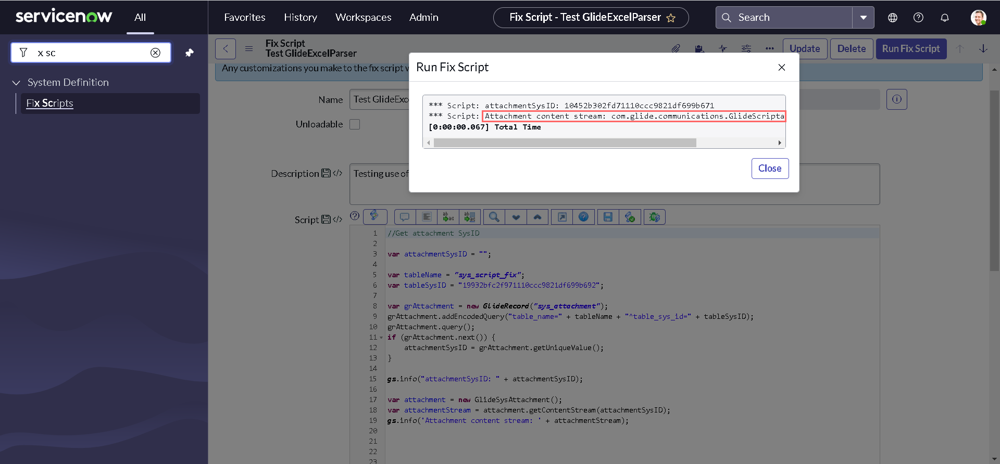

#### parse()

&nbsp;&nbsp;&nbsp;&nbsp;In order to parse our demo data sheet we can use `parse()` function, that parses an XLSX-formatted Excel document provided as an input stream. let us add following lines at the end of our script:

```javascript
var parser = new sn_impex.GlideExcelParser();
parser.parse(attachmentStream);
gs.info("typeof parser: "+typeof parser);
gs.info("parser: "+parser);

```


&nbsp;&nbsp;&nbsp;&nbsp;After executing the code again, you should get output similar to this:

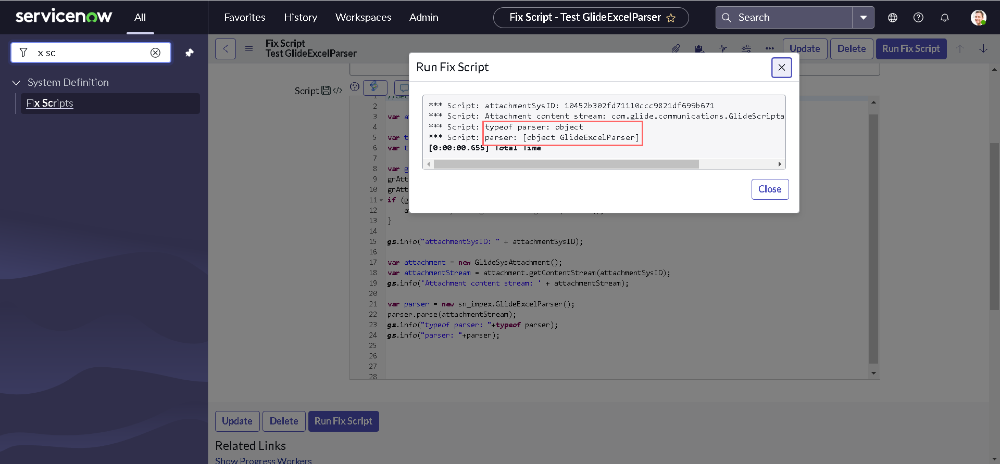

&nbsp;&nbsp;&nbsp;&nbsp;And since now we know that `parser` is an object of type `GlideExcelParser`, we can play with this.

#### getColumnHeaders()

&nbsp;&nbsp;&nbsp;&nbsp;`getColumnHeaders()` returns a list of column headers from the parsed document as an array of strings. In order to understand this better, let us comment the old log statements and add following lines at the end of our script:

```javascript
var headers = parser.getColumnHeaders();
gs.info("headers: " + headers);
for (var i = 0; i < headers.length; i++) {
    gs.info("header " + (i + 1) + ": " + headers[i]);
}
```

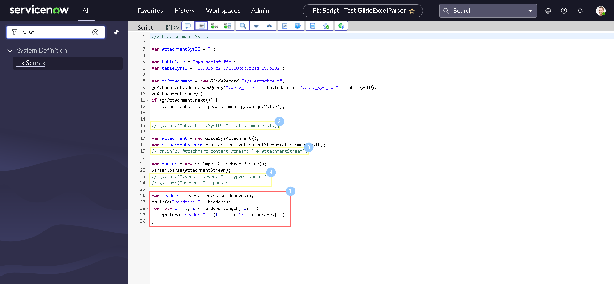

&nbsp;&nbsp;&nbsp;&nbsp;After executing the code again, you should be able to see the list of all column headers from our attachments:

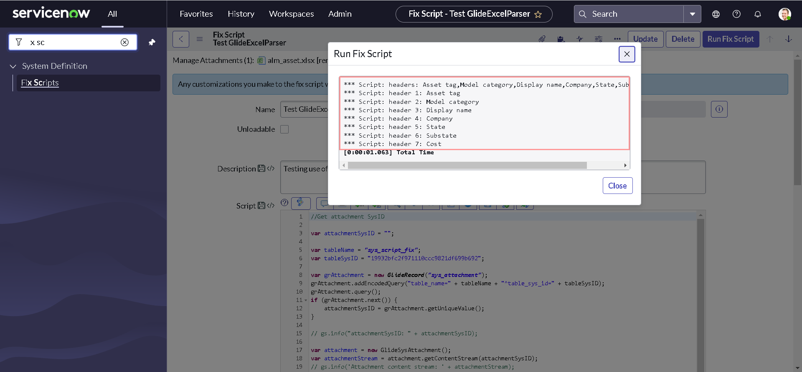
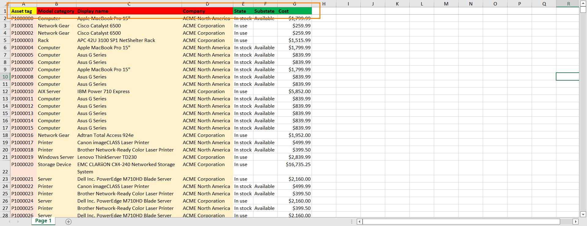

#### getSheetNames()

&nbsp;&nbsp;&nbsp;&nbsp;`getSheetNames()` returns a list of all worksheet names, ordered as positioned from left to right in the workbook as an array of strings (including any worksheets marked as hidden). In order to understand this better, let us comment last four statements of our code and add following lines at the end of our script:

```javascript
var list_sheet_name = parser.getSheetNames();
gs.info(" Sheet Names: " + list_sheet_name.join(", "));
for (var j = 0; j < list_sheet_name.length; j++) {
    gs.info("Sheet " + (j + 1) + ": " + list_sheet_name[j]);
}
```

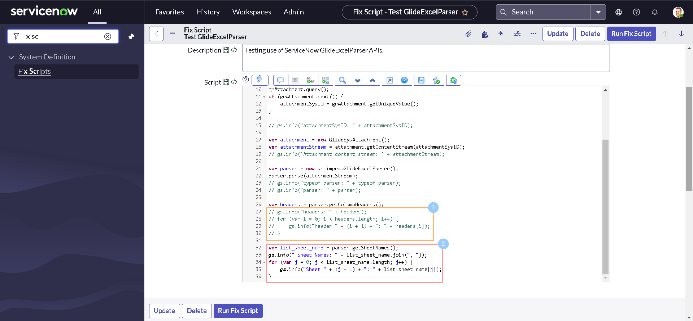

&nbsp;&nbsp;&nbsp;&nbsp;After executing the code again, you should be able to see the list of all worksheets from our attachments. In our demo sheet there is only one worksheet and we can see it logged in our output:

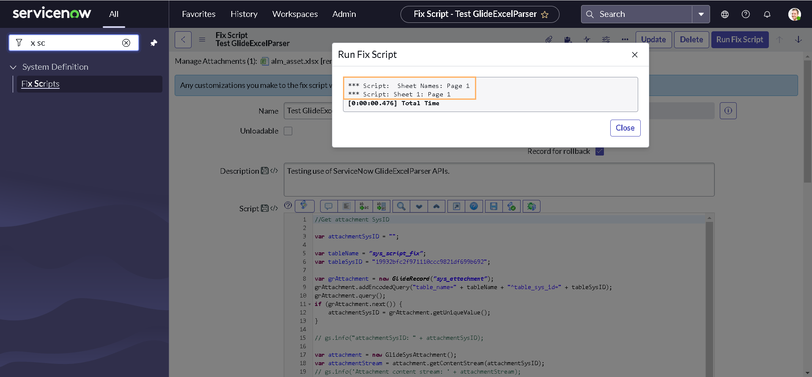
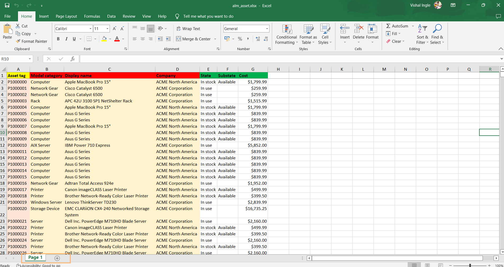

#### next() & getRow()

&nbsp;&nbsp;&nbsp;&nbsp;Now that we know how to get all column names, lets find out how to retrieve the information for each row. Just like `GlideRecord`, `next()` in GlideExcelParser is also used to loop through each of the row in an object. However, It is `getRow()` that actually returns the current row values and headers as an object. *The row headers are stored as property names and the row values are stored as property values.*

&nbsp;&nbsp;&nbsp;&nbsp;Let's see this in action by commenting last five statements of our code and add following lines at the end of our script:

```js
while (parser.next()) {
    var row = parser.getRow();
    gs.info("typeof row: " + typeof row);
    gs.info("row: " + row);
    gs.info("row: " + JSON.stringify(row, null, 4));
}
```


&nbsp;&nbsp;&nbsp;&nbsp;After executing the code again, you should get output similar to this:

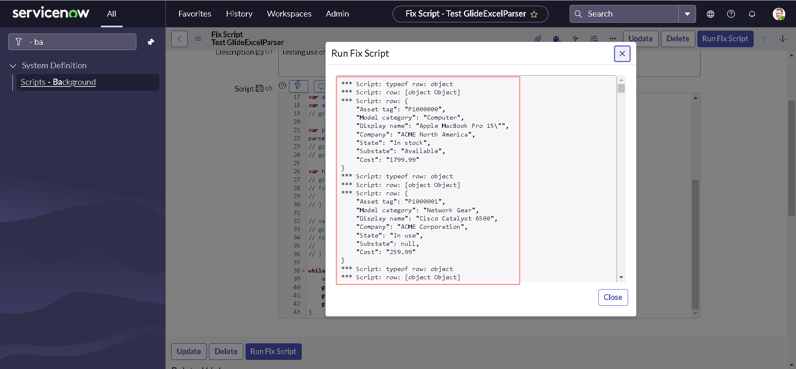

&nbsp;&nbsp;&nbsp;&nbsp;Since we know that `row` is an javascript object, with column headers as keys and cell data as property values. We can easily retrieve the the sheet data by modifying the code inside while loop as below:

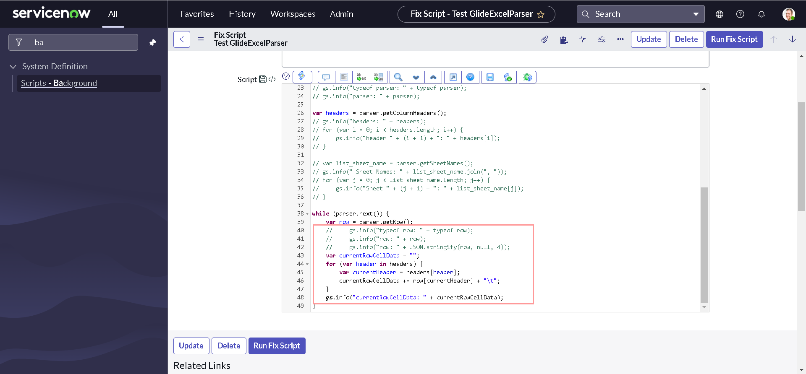

&nbsp;&nbsp;&nbsp;&nbsp;After executing the code again, you should get output with all the cell data from our demo data sheet:

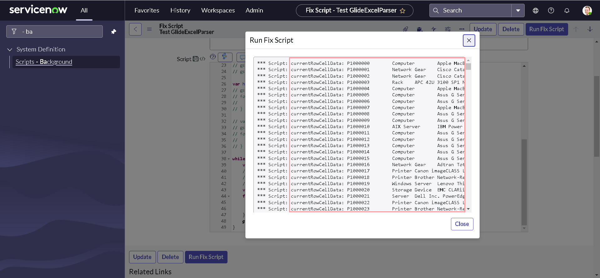

---

####

&nbsp;&nbsp;&nbsp;&nbsp;

```javascript

```


&nbsp;&nbsp;&nbsp;&nbsp;


```javascript

```


