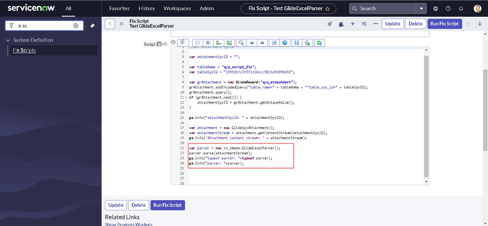
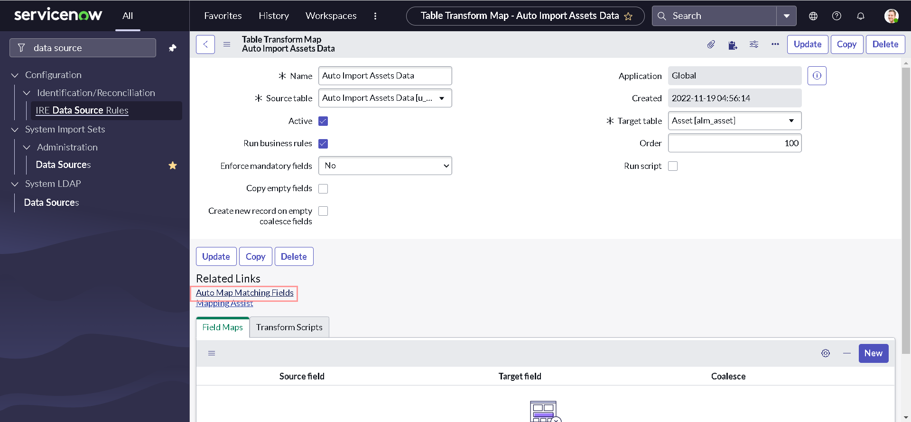
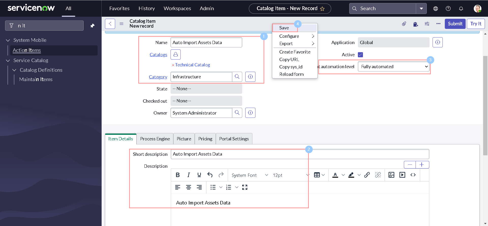
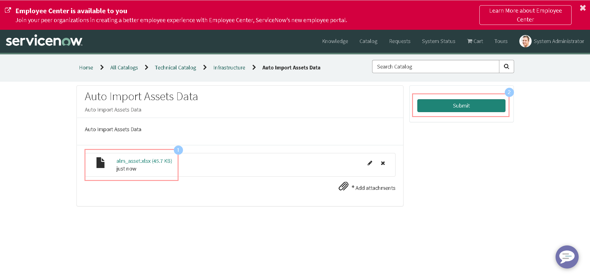
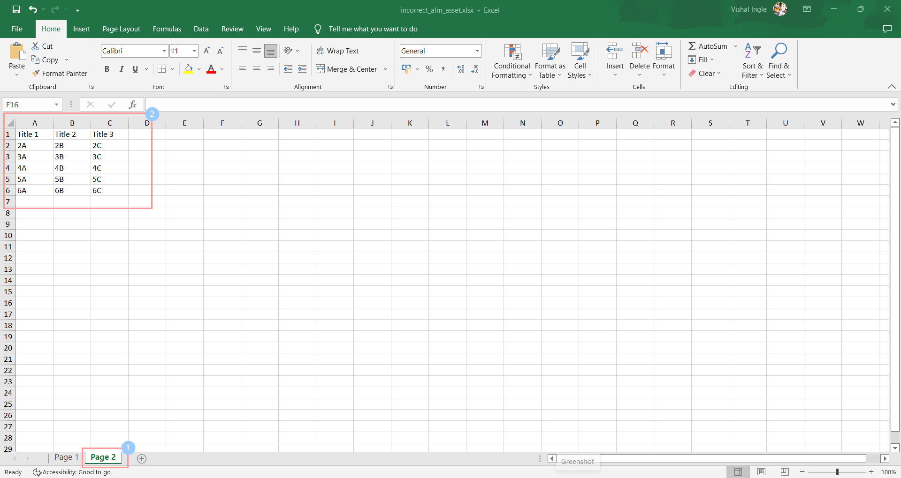
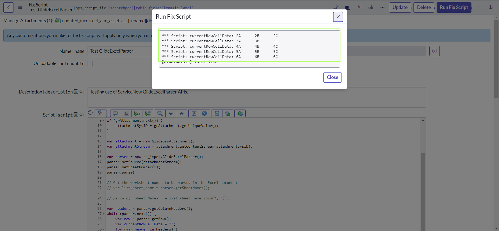

# GlideExcelParser

&nbsp;&nbsp;&nbsp;&nbsp;Recently, we did recieve a requirement to build a catalog item for Asset managers, to auto-import asset information in the platform based on attached excel sheet. Additionally, we had to reject the request if the data is missing or does not have referenced records available yet in the system.

&nbsp;&nbsp;&nbsp;&nbsp;While exploring a bit, I found this amazing API called **GlideExcelParser** documented [here](https://developer.servicenow.com/dev.do#!/reference/api/quebec/server/GEPS-setNullToEmpty_B). If you haven't used it yet like me, Let's explore together.

&nbsp;&nbsp;&nbsp;&nbsp;If you are not a nerdy kind of guy, who can read the whole big article below; you might want to check short youtube video [GlideExcelParser by Saikiran Guduri](https://www.youtube.com/watch?v=PSgv9I05k98) instead.

## What is GlideExcelParser

&nbsp;&nbsp;&nbsp;&nbsp;`GlideExcelParser` parses `.xlsx` formatted Excel files and access file data in a script.
Although, GlideExcelParser methods can be used in both global and scoped scripts, you need to use the `sn_impex` namespace identifier to create a GlideExcelParser object.

&nbsp;&nbsp;&nbsp;&nbsp;What it means is, to creates an instance of GlideExcelParser, we need to use the following syntax:

```javascript
var parser = new sn_impex.GlideExcelParser();
```

### Creating a demo data sheet

&nbsp;&nbsp;&nbsp;&nbsp;Though, ServiceNow documentation is very clear and pretty self-explanatory (along with the awesome, easy to understand examples), what lacks for this API documentation is a demo data sheet to visualize it better. So before proceeding furthur, Let's create a demo data sheet for ourselves:

- Navigate to **All > Asset > Portfolios > All Assets**.


- Open the condition builder by clicking the **show/hid filter icon**; Build a condition as shown below and Click **Run** to apply the filter.


- Click the **personalize list icon** in the upper left corner.


- Remove the columns **Assigned to** and **Configuration item**.


- To export a list report as an Excel spreadsheet, right-click any column heading and select **Export > Excel**.


- Click **Download**.


- Open the downloaded excel sheet.


- Notice the column headings.


- Let us apply some formatting to the excel sheet. However, it is not manadatory.


&nbsp;&nbsp;&nbsp;&nbsp;I have marked **Asset tag** as Yellow to indicate it is a mandatory field. similarly, **Model category**, **Display name** (indicating Model) & **Company** are marked in Red to indicate they are both mandatory and reference fields. **State**, **Substate** & **Cost** are not mandatory and hence marked in Green.

### Creating a fix script

&nbsp;&nbsp;&nbsp;&nbsp;It is not necessary to create a fix script for our use case. But, it is always a good idea to test if our code is working as expected. And Fix script always seems to be a better choice than Background script cause of it's capabilities. Also, In order to test our APIs with the demo sheet that we did create, It needs to be in the platform as an attachment. Fix script can also solve that purpose in this case. So let's go ahead and create a fix script and attach our demo sheet to it:

- Navigate to **All > System Definition > Fix Scripts** & Click **New**.


- Provide some meaningful **Name** & **Description** and Click **Submit**.


- You will be redirected back to list view. **Open** the recently created fix script.


- Click the **attachments icon**.


- Click **Choose Files** or **Browse**, depending on your browser, and navigate to a file. Then, Click **Attach**.


- Notice that our demo data sheet appears in the Current file attachments list; Close the dialog box.


- Our demo data sheet also appears at the top of the form.


### Testing GlideExcelParser APIs

&nbsp;&nbsp;&nbsp;&nbsp;Now that we have our Fix script and demo data sheet attached to it, we are good to explore GlideExcelParser APIs. But, the very first thing that we need to test our APIs is the SysID of our demo data sheet attachment. Let's write the below code to our fix script to fetch the attachment SysID:

```javascript
//Get attachment SysID

var attachmentSysID = "";

var tableName = "sys_script_fix";
var tableSysID = "19932bfc2f971110ccc9821df699b692";

var grAttachment = new GlideRecord("sys_attachment");
grAttachment.addEncodedQuery("table_name=" + tableName + "^table_sys_id=" + tableSysID);
grAttachment.query();
if (grAttachment.next()) {
    attachmentSysID = grAttachment.getUniqueValue();
}

gs.info("attachmentSysID: " + attachmentSysID);
```

&nbsp;&nbsp;&nbsp;&nbsp;You should replace the value of `tableSysID` by SysID of your fix script. Right click on the form header and click `Save` to save your code.


&nbsp;&nbsp;&nbsp;&nbsp;To test if we are getting the SysID of our attachment, Click `Run Fix Script` button on the header and then select `Proceed`.


&nbsp;&nbsp;&nbsp;&nbsp;As soon as the code finishes execution, we can see the output with the SysID of our attachment returned. Click `Close` to close the dialog window.


#### GlideSysAttachment getContentStream()

&nbsp;&nbsp;&nbsp;&nbsp;`getContentStream()` function of `GlideSysAttachment` accepts attachment `sys_id` as a parameter and returns a `GlideScriptableInputStream` object given the sys_id of an attachment that contains the content of an attachment. GlideSysAttachment APIs is a separate topic of discussion and we might talk about it in future articles, but for now, let us add following lines at the end of our script:

```javascript
var attachment = new GlideSysAttachment();
var attachmentStream = attachment.getContentStream(attachmentSysID);
gs.info('Attachment content stream: ' + attachmentStream);
```


&nbsp;&nbsp;&nbsp;&nbsp;After executing the code again, you should get output similar to this:


#### parse()

&nbsp;&nbsp;&nbsp;&nbsp;In order to parse our demo data sheet we can use `parse()` function, that parses an XLSX-formatted Excel document provided as an input stream. let us add following lines at the end of our script:

```javascript
var parser = new sn_impex.GlideExcelParser();
parser.parse(attachmentStream);
gs.info("typeof parser: "+typeof parser);
gs.info("parser: "+parser);

```



&nbsp;&nbsp;&nbsp;&nbsp;After executing the code again, you should get output similar to this:


&nbsp;&nbsp;&nbsp;&nbsp;And since now we know that `parser` is an object of type `GlideExcelParser`, we can play with this.

#### getColumnHeaders()

&nbsp;&nbsp;&nbsp;&nbsp;`getColumnHeaders()` returns a list of column headers from the parsed document as an array of strings. In order to understand this better, let us comment the old log statements and add following lines at the end of our script:

```javascript
var headers = parser.getColumnHeaders();
gs.info("headers: " + headers);
for (var i = 0; i < headers.length; i++) {
    gs.info("header " + (i + 1) + ": " + headers[i]);
}
```


&nbsp;&nbsp;&nbsp;&nbsp;After executing the code again, you should be able to see the list of all column headers from our attachments:


#### getSheetNames()

&nbsp;&nbsp;&nbsp;&nbsp;`getSheetNames()` returns a list of all worksheet names, ordered as positioned from left to right in the workbook as an array of strings (including any worksheets marked as hidden). In order to understand this better, let us comment last four statements of our code and add following lines at the end of our script:

```javascript
var list_sheet_name = parser.getSheetNames();
gs.info(" Sheet Names: " + list_sheet_name.join(", "));
for (var j = 0; j < list_sheet_name.length; j++) {
    gs.info("Sheet " + (j + 1) + ": " + list_sheet_name[j]);
}
```


&nbsp;&nbsp;&nbsp;&nbsp;After executing the code again, you should be able to see the list of all worksheets from our attachments. In our demo sheet there is only one worksheet and we can see it logged in our output:


#### next() & getRow()

&nbsp;&nbsp;&nbsp;&nbsp;Now that we know how to get all column names, lets find out how to retrieve the information for each row. Just like `GlideRecord`, `next()` in GlideExcelParser is also used to loop through each of the row in an object. However, It is `getRow()` that actually returns the current row values and headers as an object. *The row headers are stored as property names and the row values are stored as property values.*

&nbsp;&nbsp;&nbsp;&nbsp;Let's see this in action by commenting last five statements of our code and add following lines at the end of our script:

```js
while (parser.next()) {
    var row = parser.getRow();
    gs.info("typeof row: " + typeof row);
    gs.info("row: " + row);
    gs.info("row: " + JSON.stringify(row, null, 4));
}
```


&nbsp;&nbsp;&nbsp;&nbsp;After executing the code again, you should get output similar to this:


&nbsp;&nbsp;&nbsp;&nbsp;Since we know that `row` is an javascript object, with column headers as keys and cell data as property values. We can easily retrieve the the sheet data by modifying the code inside while loop as below:

```js
while (parser.next()) {
    var row = parser.getRow();
    //     gs.info("typeof row: " + typeof row);
    //     gs.info("row: " + row);
    //     gs.info("row: " + JSON.stringify(row, null, 4));
    var currentRowCellData = "";
    for (var header in headers) {
        var currentHeader = headers[header];
        currentRowCellData += row[currentHeader] + "\t";
    }
    gs.info("currentRowCellData: " + currentRowCellData);
}
```


&nbsp;&nbsp;&nbsp;&nbsp;After executing the code again, you should get output with all the cell data from our demo data sheet:


### Break Time

&nbsp;&nbsp;&nbsp;&nbsp;Now that we have basic understanding of some of the APIs, It is good time to take a break and get back to our business requirement. Let us modify our code to check if any of the mandatory `Asset Tag`, `Model` or `Model category` is empty:

```js
var mandatoryHeaders = ["Asset tag", "Display name", "Model category"];
while (parser.next()) {
    var row = parser.getRow();

    for (var header in mandatoryHeaders) {
        var currentHeader = mandatoryHeaders[header];

        if (JSUtil.nil(row[currentHeader])) {
            gs.info("No value provided for mandatory column: " + currentHeader);
        }

    }
}
```


&nbsp;&nbsp;&nbsp;&nbsp;If you have noticed already, I did remove all the comments from the code and modified the script within while loop to perform our validation for empty values of mandatory columns. And I have declared an additional array to store the mandatory column headers which has been used later in the loop. Here's how the whole script looks like:

```js
var attachmentSysID = "";

var tableName = "sys_script_fix";
var tableSysID = "19932bfc2f971110ccc9821df699b692";

var grAttachment = new GlideRecord("sys_attachment");
grAttachment.addEncodedQuery("table_name=" + tableName + "^table_sys_id=" + tableSysID);
grAttachment.query();
if (grAttachment.next()) {
    attachmentSysID = grAttachment.getUniqueValue();
}

var attachment = new GlideSysAttachment();
var attachmentStream = attachment.getContentStream(attachmentSysID);

var parser = new sn_impex.GlideExcelParser();
parser.parse(attachmentStream);

var headers = parser.getColumnHeaders();

var mandatoryHeaders = ["Asset tag", "Display name", "Model category"];
while (parser.next()) {
    var row = parser.getRow();

    for (var header in mandatoryHeaders) {
        var currentHeader = mandatoryHeaders[header];

        if (JSUtil.nil(row[currentHeader])) {
            gs.info("No value provided for mandatory column: " + currentHeader);
        }

    }
}
```

&nbsp;&nbsp;&nbsp;&nbsp;Now Let us modify our code to to add following lines to check if any of the mandatory `Model` or `Model category` is has a reference record existing in the system:


&nbsp;&nbsp;&nbsp;&nbsp;Here's how the whole script looks like:

```js
var attachmentSysID = "";

var tableName = "sys_script_fix";
var tableSysID = "19932bfc2f971110ccc9821df699b692";

var grAttachment = new GlideRecord("sys_attachment");
grAttachment.addEncodedQuery("table_name=" + tableName + "^table_sys_id=" + tableSysID);
grAttachment.query();
if (grAttachment.next()) {
    attachmentSysID = grAttachment.getUniqueValue();
}

var attachment = new GlideSysAttachment();
var attachmentStream = attachment.getContentStream(attachmentSysID);

var parser = new sn_impex.GlideExcelParser();
parser.parse(attachmentStream);

var headers = parser.getColumnHeaders();

var mandatoryHeaders = ["Asset tag", "Display name", "Model category"];
while (parser.next()) {
    var row = parser.getRow();

    for (var header in mandatoryHeaders) {
        var currentHeader = mandatoryHeaders[header];

        if (JSUtil.nil(row[currentHeader])) {
            gs.info("No value provided for mandatory column: " + currentHeader);
        }

        if (checkReference(currentHeader, row[currentHeader]) === "NoReference") {
            gs.info("Referenced value " + row[currentHeader] + " does not exist for mandatory column: " + currentHeader);
        }

    }
}

function checkReference(cellHeader, cellData) {
    if (cellHeader == "Display name") {
        var grModel = new GlideRecord("cmdb_model");
        grModel.addQuery("display_name", cellData);
        grModel.query();
        if (!grModel.hasNext()) {
            return "NoReference";
        }
    }
    if (cellHeader == "Model category") {
        var grModelCategory = new GlideRecord("cmdb_model_category");
        grModelCategory.addQuery("name", cellData);
        grModelCategory.query();
        if (!grModelCategory.hasNext()) {
            return "NoReference";
        }

    }
    return "ReferencedRecordFound";
}
```

&nbsp;&nbsp;&nbsp;&nbsp;Let us introduce a new variable `rowNumber` for better logging as below:

```js
var rowNumber=1;
while (parser.next()) {
    var row = parser.getRow();

    for (var header in mandatoryHeaders) {
        var currentHeader = mandatoryHeaders[header];

        if (JSUtil.nil(row[currentHeader])) {
            gs.info("Row "+rowNumber+"1 - No value provided for mandatory column: " + currentHeader);
        }

        if (checkReference(currentHeader, row[currentHeader]) === "NoReference") {
            gs.info("Row "+rowNumber+"1 - Referenced value " + row[currentHeader] + " does not exist for mandatory column: " + currentHeader);
        }

    }
 rowNumber++;
}
```


&nbsp;&nbsp;&nbsp;&nbsp;Let us introduce another variable `insufficientData` to check if manadatory column is empty or reference does not exist:

```js
var insufficientData="FALSE";
while (parser.next()) {
    var row = parser.getRow();

    for (var header in mandatoryHeaders) {
        var currentHeader = mandatoryHeaders[header];

        if (JSUtil.nil(row[currentHeader])) {
            gs.info("Row "+rowNumber+" - No value provided for mandatory column: " + currentHeader);
   insufficientData="TRUE";
        }

        if (checkReference(currentHeader, row[currentHeader]) === "NoReference") {
            gs.info("Row "+rowNumber+" - Referenced value " + row[currentHeader] + " does not exist for mandatory column: " + currentHeader);
   insufficientData="TRUE";
        }

    }
 rowNumber++;
}
```


&nbsp;&nbsp;&nbsp;&nbsp;Before testing the code, we need to make two more changes for our use case. We will analyze the whole sheet for not sufficient data and will log the information only once. Let us modify the code one more time as below:


&nbsp;&nbsp;&nbsp;&nbsp;Now our final code should look like this:

```js
var attachmentSysID = "";

var tableName = "sys_script_fix";
var tableSysID = "19932bfc2f971110ccc9821df699b692";

var grAttachment = new GlideRecord("sys_attachment");
grAttachment.addEncodedQuery("table_name=" + tableName + "^table_sys_id=" + tableSysID);
grAttachment.query();
if (grAttachment.next()) {
    attachmentSysID = grAttachment.getUniqueValue();
}

var attachment = new GlideSysAttachment();
var attachmentStream = attachment.getContentStream(attachmentSysID);

var parser = new sn_impex.GlideExcelParser();
parser.parse(attachmentStream);

var headers = parser.getColumnHeaders();

var mandatoryHeaders = ["Asset tag", "Display name", "Model category"];
var rowNumber = 1;
var insufficientData = "FALSE";
var incorrectDataLog = "Incorrect Data: \n";
while (parser.next()) {
    var row = parser.getRow();

    for (var header in mandatoryHeaders) {
        var currentHeader = mandatoryHeaders[header];

        if (JSUtil.nil(row[currentHeader])) {
            incorrectDataLog += "Row " + rowNumber + " - No value provided for mandatory column: " + currentHeader + "\n";
            insufficientData = "TRUE";
        }

        if (checkReference(currentHeader, row[currentHeader]) === "NoReference") {
            incorrectDataLog += "Row " + rowNumber + " - Referenced value " + row[currentHeader] + " does not exist for mandatory column: " + currentHeader + "\n";
            insufficientData = "TRUE";
        }

    }
    rowNumber++;
}

if (insufficientData !== "TRUE") {
    incorrectDataLog = "CorrectData";
}
gs.info(incorrectDataLog);


function checkReference(cellHeader, cellData) {
    if (cellHeader == "Display name") {
        var grModel = new GlideRecord("cmdb_model");
        grModel.addQuery("display_name", cellData);
        grModel.query();
        if (!grModel.hasNext()) {
            return "NoReference";
        }
    }
    if (cellHeader == "Model category") {
        var grModelCategory = new GlideRecord("cmdb_model_category");
        grModelCategory.addQuery("name", cellData);
        grModelCategory.query();
        if (!grModelCategory.hasNext()) {
            return "NoReference";
        }

    }
    return "ReferencedRecordFound";
}
```

#### Creating and testing Invalid Demo Data

&nbsp;&nbsp;&nbsp;&nbsp;Now that we have our code ready to be tested, we need a demo data sheet with some missing or incorrect information. Let's modify the original sheet by deleting some of the mandatory information:


&nbsp;&nbsp;&nbsp;&nbsp;Next, remove the old attachment and replace it with new attachment having incorrect data:


&nbsp;&nbsp;&nbsp;&nbsp;Executing the code again, should didplay the output like this:


&nbsp;&nbsp;&nbsp;&nbsp;But if you are really paying an attention, you will notice that it is `Row 8` and not `Row 7` which is actually empty. Same applies for other rows. The reason for this is because the first row of excel is column headers and not actually a data. Let's fix it with just increasing the initial value of `rowNumber` by 1.


&nbsp;&nbsp;&nbsp;&nbsp;Another thing that you should notice is, The API parses all the Rows in the sheet even if they are totally empty (E.g. Row 8). Unfortunately, there is no OOTB workaround for this issue available yet. You can read more about the issue [here](https://support.servicenow.com/kb?id=kb_article_view&sysparm_article=KB0693417). Though, we can skip those rows with a little trick. Let us write an additional line of code in our script:


&nbsp;&nbsp;&nbsp;&nbsp;At the end of this section, your final code should be somewhat similar to this:

```js
var attachmentSysID = "";

var tableName = "sys_script_fix";
var tableSysID = "19932bfc2f971110ccc9821df699b692";

var grAttachment = new GlideRecord("sys_attachment");
grAttachment.addEncodedQuery("table_name=" + tableName + "^table_sys_id=" + tableSysID);
grAttachment.query();
if (grAttachment.next()) {
    attachmentSysID = grAttachment.getUniqueValue();
}

var attachment = new GlideSysAttachment();
var attachmentStream = attachment.getContentStream(attachmentSysID);

var parser = new sn_impex.GlideExcelParser();
parser.parse(attachmentStream);

var headers = parser.getColumnHeaders();

var mandatoryHeaders = ["Asset tag", "Display name", "Model category"];
var rowNumber = 2;
var insufficientData = "FALSE";
var incorrectDataLog = "Incorrect Data: \n";
while (parser.next()) {
    var row = parser.getRow();

    if (JSON.stringify(row, removeNullValues) === "{}") {
        continue;
    }

    for (var header in mandatoryHeaders) {
        var currentHeader = mandatoryHeaders[header];

        if (JSUtil.nil(row[currentHeader])) {
            incorrectDataLog += "Row " + rowNumber + " - No value provided for mandatory column: " + currentHeader + "\n";
            insufficientData = "TRUE";
        }

        if (checkReference(currentHeader, row[currentHeader]) === "NoReference") {
            incorrectDataLog += "Row " + rowNumber + " - Referenced value " + row[currentHeader] + " does not exist for mandatory column: " + currentHeader + "\n";
            insufficientData = "TRUE";
        }

    }
    rowNumber++;
}

function removeNullValues(key, value) {
    if (value != null) {
        return value;
    }
}

if (insufficientData !== "TRUE") {
    incorrectDataLog = "CorrectData";
}
gs.info(incorrectDataLog);


function checkReference(cellHeader, cellData) {
    if (cellHeader == "Display name") {
        var grModel = new GlideRecord("cmdb_model");
        grModel.addQuery("display_name", cellData);
        grModel.query();
        if (!grModel.hasNext()) {
            return "NoReference";
        }
    }
    if (cellHeader == "Model category") {
        var grModelCategory = new GlideRecord("cmdb_model_category");
        grModelCategory.addQuery("name", cellData);
        grModelCategory.query();
        if (!grModelCategory.hasNext()) {
            return "NoReference";
        }

    }
    return "ReferencedRecordFound";
}
```

&nbsp;&nbsp;&nbsp;&nbsp;If you dont have any idea about how json works or why we have written the code, I highly recommend you to checkout my post on community - [What You Need To Know About JSON And Objects](https://www.servicenow.com/community/developer-articles/integratenow-chapter-2-what-you-need-to-know-about-json-and/ta-p/2299591).


### Building a Data Source and Transform Map

&nbsp;&nbsp;&nbsp;&nbsp;So we have our script to validate the Excel sheet. But, we did not do anything for loading the excel data to the platform. Let's build a data source and transform map, which we can use later in our script to automate the process.

- Navigate to **All > System Import Sets > Administration > Data Sources** and Click **New**.


- Provide some meaningful **Name** & **Import set table label**. Select other details as below before clicking **Submit**:
  - Type: **File**
  - Format: **Excel**
  - Sheet number: **1**
  - Header row: **1**
  - File retrieval method: **Attachment**
  
  

- You will be navigated back to list view. Open the recently created Data source record.


- Add our demo sheet as an attachment to the current record.


- Click **Test Load 20 Records** related link at the bottom of the form.


&nbsp;&nbsp;&nbsp;&nbsp;The **Test Load 20 Records** UI action is generally used to validate the records that you want to import without the initial intention of running a transformation map to the target table. This action sets the internal state of the import to Load, therefore the transformation map is skipped. There are two good articles regarding this on [NowSupport](https://support.servicenow.com/kb?id=kb_article_view&sysparm_article=KB0563963) & [Community](https://www.servicenow.com/community/developer-blog/transforming-your-data-quot-load-all-records-quot-vs-quot-test/ba-p/2282437) that you must read.

- Once data is loaded, click the **Create transform map** link.


- Provide some meaningful **Name** and Select the **Target table** as **Asset**, then right click on the form header and select **Save**.


- Click the **Auto Map Matching Fields** Related Link for ServiceNow to attempt to match the staging table columns to the target table columns based on column name.


- Set the Coalesce value to true to use an **Asset tag** field to check for collisions.


&nbsp;&nbsp;&nbsp;&nbsp;If a match is found using the coalesce fields, the target record is updated with the information imported from the staging table. If no match is found, a new record is inserted in the database. If no fields are coalesce fields, records are always inserted on import. You can read more about [coalescing](coalescing) on developer portal.

- Note down the **Import set table name** from data source and **SysID** of recently created transform map for later reference (we need it!).


&nbsp;&nbsp;&nbsp;&nbsp;If you did not use data source or transform map earlier [Importing Data](https://developer.servicenow.com/dev.do#!/learn/learning-plans/tokyo/new_to_servicenow/app_store_learnv2_importingdata_tokyo_importing_data_objectives) is a good place to start.

### Building Catalog item and Workflow

&nbsp;&nbsp;&nbsp;&nbsp;Now that we have all pre-requisites (a validation script, a data source and a transform map), we can go ahead and create a Catalog item to realize our business requirement.

- Navigate to **Service Catalog > Catalog Definition > Maintain Items** & Click **New**.


- Provide some meaningful **Name**, **Short Description** & **Description**. Select other details as below and **Save** the form:
  - Catalogs: **Technical Catalog**
  - Category: **Infrastructure**
  - Fulfillment automation level: **Fully automated**
  
  

- Under **Portal Settings** section, Select **Request method** as **Submit** and mark **Hide 'Add to Wish List'** & **Mandatory Attachment** as checked.


- Under **Process Engine**, click the magnifying glass besides **Workflow** field.


- Click **New**


- Provide some meaningful **Name** and **Description** and click **Submit**.


- The new workflow is created with the Begin and End activities connected by a single transition.


- Switch to the **Core** tab in the Palette. **Click, hold, and drag** the **Run Script** activity onto the canvas. Hover the activity over a transition. When the transition turns blue, drop the activity.


- Add some meaningful **Name** and **Stage**. Then Copy the final fix script created in first step and paste here in the **Script** field.


- Change the values of variable **tableName** & **tableSysID** as below:
  
```js
var tableName = current.sys_class_name;
var tableSysID = current.sys_id;
```


- Since we already know the list of mandatory columns to be validated; Let's remove the following line of code as we are not going to need it.

```js
var headers = parser.getColumnHeaders();
```


- Let's comment the log statements and add the following line of code at the end of the script, to store the additional comments in the scratchpad if data is not sufficient or incorrect. Then Click **Submit**.
  
```js
workflow.scratchpad.insufficient_data = insufficientData;
workflow.scratchpad.incorrect_lata_log = incorrectDataLog;
```


- Double click the **If** activity.


- Give some meaningful **Name** and **Stage**.


- Select the **Advanced** check box and add the following script to the **Script** before clicking **Submit**.
  
```js
answer = ifScript();

function ifScript() {
    if (workflow.scratchpad.insufficient_data === "TRUE") {
        return 'yes';
    }
    return 'no';
}
```


- Next, Double click on **Set Values** activity and set the values as below, then click **Submit**:
  - Name: **Closed Incomplete**
  - Stage: **Completed**
  - Set these values:
    - State: **Closed inomplete**
    - Additional comments: **${workflow.scratchpad.incorrect_lata_log}**

  

- Similarly, Double click on **Set Values** activity again and set the values as below, then click **Submit**:
  - Name: **Closed complete**
  - Stage: **Completed**
  - Set these values:
    - State: **Closed complete**

  

- Finally, Double click the new **Run script** activity. Add the following script to the **Script** field:

```js
//Create a Data Source and Copy an attachment from RITM to Data Source
var donorTable = current.sys_class_name;
var donorID = current.sys_id;

var recipientTable = "sys_data_source";

var recipientTableGR = new GlideRecord(recipientTable);
recipientTableGR.name = gs.getUserName() + " UserImport at: " + new GlideDateTime();
recipientTableGR.import_set_table_name = 'u_auto_import_assets_data'; 
recipientTableGR.file_retrieval_method = "Attachment";
recipientTableGR.type = "File";
recipientTableGR.format = "Excel";
recipientTableGR.header_row = 1;
recipientTableGR.sheet_number = 1;

var recipientID = recipientTableGR.insert(); //Need this since we want to load and transform directly

GlideSysAttachment.copy(donorTable, donorID, recipientTable, recipientID);

//Load the data from attachment to Staging table
var dataSourceGR = new GlideRecord("sys_data_source");
dataSourceGR.get(recipientID);
var loader = new GlideImportSetLoader();
var importSetRec = loader.getImportSetGr(dataSourceGR);
var ranload = loader.loadImportSetTable(importSetRec, dataSourceGR);
importSetRec.state = "loaded";
importSetRec.update();

//Transform the data into system database
var transformMapSysIDs = '1f25c5492f1f1110ccc9821df699b642';

var transformWorker = new GlideImportSetTransformerWorker(importSetRec.sys_id, transformMapSysIDs);
transformWorker.setBackground(true);
transformWorker.start();
```

&nbsp;&nbsp;&nbsp;&nbsp;For the sake of this article, I'm not going to explain the above script details. May be it could be a content for another article. But to be short we are loading the data from our sheet to import set table that we created and then transforming it to assets table. To understand better what is happening here, I encourage you to check teh youtube video [Upload data with an excel file and Record producer in ServiceNow by Göran Lundqvist](https://www.youtube.com/watch?v=_NvSNzk1_Og).


- Don't forget to replace the **Import set table name** and **Transform Map SysID** noted from second step before clicking **Submit**:


- Now configure transitions for all activities as shown in the screenshot below:


- Let's navigate back to our catalog item window and select the newly created workflow and **Update** the catalog item.


- In order to see the Technical Catalog on our Service Portal, we need to do some additional configurations. Navigate to **All > Service Portal > Portals** & Click the **Service Portal** record.


- In the Catalogs related list, click **Edit**.


- Select **Technical Catalog** to add to the portal and click **Save**


&nbsp;&nbsp;&nbsp;&nbsp;Well we are done with our development and it is a time for unit testing:

- Navigate to Service Portal and click **Request Something**.


- Now, we should be able to see our newly created catalog item under **Infrastructure** category of Technical Catalog. Click to **open** it.


- Add our incorrect demo data sheet as an attachment and click **Submit**.


- Click on the catalog item name on the Ticket summary form to see the additional comments with error logs:


- Perform another test with correct sheet to make sure that data is loaded correctly to asset table:



### Time's up!

&nbsp;&nbsp;&nbsp;&nbsp;So we have successfully fulfilled  our business requirement. For the sake of this article, we have done very basic configurations. But in real life scenerio, you might need to have error handling mechanism, additional approvals, user criterias etc. But we won't go to that. Now, it is time to go back to our GlideExcelParserAPIs.

&nbsp;&nbsp;&nbsp;&nbsp;Let us modify our incorrect demo data sheet before proceeding furthur. Add another sheet with some demo data. E.g.:



&nbsp;&nbsp;&nbsp;&nbsp;Now navigate back to our fix script created in step one and replace the attachment with new updated sheet:


&nbsp;&nbsp;&nbsp;&nbsp;Lets remove the entire code from line number 19, as we do not need it for furthur testing:


&nbsp;&nbsp;&nbsp;&nbsp;Our new script now should look like this:

```js
var attachmentSysID = "";

var tableName = "sys_script_fix";
var tableSysID = "19932bfc2f971110ccc9821df699b692";

var grAttachment = new GlideRecord("sys_attachment");
grAttachment.addEncodedQuery("table_name=" + tableName + "^table_sys_id=" + tableSysID);
grAttachment.query();
if (grAttachment.next()) {
    attachmentSysID = grAttachment.getUniqueValue();
}

var attachment = new GlideSysAttachment();
var attachmentStream = attachment.getContentStream(attachmentSysID);

var parser = new sn_impex.GlideExcelParser();
parser.parse(attachmentStream);
```


#### setSheetName() & setSheetNumber()

&nbsp;&nbsp;&nbsp;&nbsp;**setSheetName()** sets the name of the sheet to be retrieved. Whereas, **setSheetNumber()** sets the number of the Excel sheet to be retrieved. However, It worths remembering that if both setSheetNumber() and setSheetName() are set, setSheetName() is used.

&nbsp;&nbsp;&nbsp;&nbsp;Add the following lines of code at the end of our sheet to retrive all sheet names:

```js
// Get the worksheet names to be parsed in the Excel document
var list_sheet_name = parser.getSheetNames();

gs.info(" Sheet Names " + list_sheet_name.join(", "));
```


&nbsp;&nbsp;&nbsp;&nbsp;After executing the code, we should be able to see both of our the sheet names in the output:


&nbsp;&nbsp;&nbsp;&nbsp;Now to test **setSheetName** first, Let's modify our code as below:

```js
var attachmentSysID = "";

var tableName = "sys_script_fix";
var tableSysID = "19932bfc2f971110ccc9821df699b692";

var grAttachment = new GlideRecord("sys_attachment");
grAttachment.addEncodedQuery("table_name=" + tableName + "^table_sys_id=" + tableSysID);
grAttachment.query();
if (grAttachment.next()) {
    attachmentSysID = grAttachment.getUniqueValue();
}

var attachment = new GlideSysAttachment();
var attachmentStream = attachment.getContentStream(attachmentSysID);

var parser = new sn_impex.GlideExcelParser();
parser.setSource(attachmentStream);
parser.setSheetName("Page 2");
parser.parse();

// Get the worksheet names to be parsed in the Excel document
// var list_sheet_name = parser.getSheetNames();

// gs.info(" Sheet Names " + list_sheet_name.join(", "));

var headers = parser.getColumnHeaders();
while (parser.next()) {
    var row = parser.getRow();
    var currentRowCellData = "";
    for (var header in headers) {
        var currentHeader = headers[header];
        currentRowCellData += row[currentHeader] + "\t";
    }
    gs.info("currentRowCellData: " + currentRowCellData);
}
```


&nbsp;&nbsp;&nbsp;&nbsp;After executing the code, we should be able to see the data from sheet "Page 2" :


&nbsp;&nbsp;&nbsp;&nbsp;If you are paying an attention so far, we have an additional method **setSource**  that we did not yet discussed and slightly different version of **parse** (without parameter); but they play very important role in this case. We will talk about them next, but first let test our next API i.e. **setSheetNumber**.

&nbsp;&nbsp;&nbsp;&nbsp;Let's modify our code to use **setSheetNumber** instead of **setSheetName**. Please note that 0 denotes sheet 1, 1 denotes sheet 2 & so on...:

```js
parser.setSheetNumber(1);
```


&nbsp;&nbsp;&nbsp;&nbsp;After executing the code, we should be able to see the same output as above:



&nbsp;&nbsp;&nbsp;&nbsp;It worth mentioning that, it is not necessary to use **setSource** and we can as well do it the old way as shown below:

```js
var attachmentSysID = "";

var tableName = "sys_script_fix";
var tableSysID = "19932bfc2f971110ccc9821df699b692";

var grAttachment = new GlideRecord("sys_attachment");
grAttachment.addEncodedQuery("table_name=" + tableName + "^table_sys_id=" + tableSysID);
grAttachment.query();
if (grAttachment.next()) {
    attachmentSysID = grAttachment.getUniqueValue();
}

var attachment = new GlideSysAttachment();
var attachmentStream = attachment.getContentStream(attachmentSysID);

var parser = new sn_impex.GlideExcelParser();
parser.setSheetNumber(1); 
parser.parse(attachmentStream);

// Get the worksheet names to be parsed in the Excel document
// var list_sheet_name = parser.getSheetNames();

// gs.info(" Sheet Names " + list_sheet_name.join(", "));

var headers = parser.getColumnHeaders();
while (parser.next()) {
    var row = parser.getRow();
    var currentRowCellData = "";
    for (var header in headers) {
        var currentHeader = headers[header];
        currentRowCellData += row[currentHeader] + "\t";
    }
    gs.info("currentRowCellData: " + currentRowCellData);
}
```


#### setSource()

&nbsp;&nbsp;&nbsp;&nbsp;**setSource()** defines an input source for parsing multiple times or parsing each worksheet in an Excel file.

&nbsp;&nbsp;&nbsp;&nbsp;E.g. In our demo sheet, we have two sheets "Page 1" & "Page 2". We can use **setSource** to parse an Excel file attachment multiple times to retrieve column headers and print values of each row for each worksheet.

&nbsp;&nbsp;&nbsp;&nbsp;Let's copy a part of code and paste it again at the end of the script and just change the sheet number. We will get some warnings as we are not following the coding best practices, but let's ignore them for a moment:

```js
var attachmentSysID = "";

var tableName = "sys_script_fix";
var tableSysID = "19932bfc2f971110ccc9821df699b692";

var grAttachment = new GlideRecord("sys_attachment");
grAttachment.addEncodedQuery("table_name=" + tableName + "^table_sys_id=" + tableSysID);
grAttachment.query();
if (grAttachment.next()) {
    attachmentSysID = grAttachment.getUniqueValue();
}

var attachment = new GlideSysAttachment();
var attachmentStream = attachment.getContentStream(attachmentSysID);

var parser = new sn_impex.GlideExcelParser();
parser.setSource(attachmentStream);
parser.setSheetNumber(1);
parser.parse();

var headers = parser.getColumnHeaders();
while (parser.next()) {
    var row = parser.getRow();
    var currentRowCellData = "";
    for (var header in headers) {
        var currentHeader = headers[header];
        currentRowCellData += row[currentHeader] + "\t";
    }
    gs.info("currentRowCellData: " + currentRowCellData);
}

parser.setSheetNumber(0);
parser.parse();

var headers = parser.getColumnHeaders();
while (parser.next()) {
    var row = parser.getRow();
    var currentRowCellData = "";
    for (var header in headers) {
        var currentHeader = headers[header];
        currentRowCellData += row[currentHeader] + "\t";
    }
    gs.info("currentRowCellData: " + currentRowCellData);
}
```


&nbsp;&nbsp;&nbsp;&nbsp;Observe that we did parse each of the sheet using same parser and were able to retrieve the data:


&nbsp;&nbsp;&nbsp;&nbsp;Lets modify our code to be better and parse all sheet's data automatically:

```js
var attachmentSysID = "";

var tableName = "sys_script_fix";
var tableSysID = "19932bfc2f971110ccc9821df699b692";

var grAttachment = new GlideRecord("sys_attachment");
grAttachment.addEncodedQuery("table_name=" + tableName + "^table_sys_id=" + tableSysID);
grAttachment.query();
if (grAttachment.next()) {
    attachmentSysID = grAttachment.getUniqueValue();
}

var attachment = new GlideSysAttachment();
var attachmentStream = attachment.getContentStream(attachmentSysID);

var parser = new sn_impex.GlideExcelParser();
parser.setSource(attachmentStream);

// Get the worksheet names to be parsed in the Excel document
var list_sheet_name = parser.getSheetNames();
gs.info(" Sheet Names " + list_sheet_name.join(", "));

// Iterate over each worksheet in the Excel workbook
for (var i = 0; i < list_sheet_name.length; i++) {

    gs.info("Sheet name:    " + list_sheet_name[i]);

    // Set the worksheet name to be parsed
    parser.setSheetName(list_sheet_name[i]);

    parser.parse();

    var headers = parser.getColumnHeaders();
    while (parser.next()) {
        var row = parser.getRow();
        var currentRowCellData = "";
        for (var header in headers) {
            var currentHeader = headers[header];
            currentRowCellData += row[currentHeader] + "\t";
        }
        gs.info("currentRowCellData: " + currentRowCellData);
    }

}
```


&nbsp;&nbsp;&nbsp;&nbsp;Observe that we did parse each of the sheet using same parser and were able to retrieve the data:


&nbsp;&nbsp;&nbsp;&nbsp;The best example for this API can be found at [Developer portal](https://developer.servicenow.com/dev.do#!/reference/api/tokyo/server/sn_impex-namespace/GlideExcelParserScopedAPI#GEPS-setSource_O?navFilter=GlideExcelParser), I encourage you to have a look at that.

&nbsp;&nbsp;&nbsp;&nbsp;The one of the important point to note here (and you might have already understood): we don't pass parameter to **parse** when used along with **setSource**.

#### setNullToEmpty()

&nbsp;&nbsp;&nbsp;&nbsp;**setNullToEmpty()** accepts one parameter which when true, return an empty value instead of null when an Excel cell is not present.

&nbsp;&nbsp;&nbsp;&nbsp;In our excel sheet there are certain cells that are empty and our script currently prints them as null:


&nbsp;&nbsp;&nbsp;&nbsp;Lets add the following line of code to our script:

```js
parser.setNullToEmpty(true);
```


&nbsp;&nbsp;&nbsp;&nbsp;Now, executing the script again should display empty value instead of null:


---